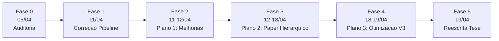
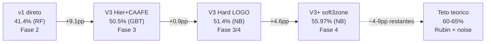

# HISTORICO do Projeto — Classificacao de Mecanismos de Missing Data (ITA-Mestrado)

**Linha do tempo completa:** 2026-04-05 a 2026-04-19 (15 dias, 6 fases)
**Pergunta de pesquisa:** Como classificar automaticamente MCAR/MAR/MNAR em datasets reais?
**Resultado final:** **55.97% LOGO CV** em 23 datasets reais (V3+ hierarquico + CAAFE + Cleanlab)
**Limite teorico estimado:** 60-65% (Rubin 1976 + 59.4% labels ruidosos)

Este documento e o **indice mestre narrativo** do projeto. Ele costura em ordem cronologica
todas as decisoes, experimentos e resultados que levaram da auditoria inicial de codigo
(com 6 bugs criticos) ate a tese final compilada (83 paginas, V3+ pipeline).

Para documentacao de codigo/pipeline (nao cronologica), ver:
- [`Scripts/README.md`](Scripts/README.md) — visao geral do codebase
- [`Scripts/v2_improved/README.md`](Scripts/v2_improved/README.md) — pipeline v2 otimizado
- [`CLAUDE.md`](../../CLAUDE.md) — comandos e arquitetura para agentes IA

---

## 1. Linha do Tempo (6 fases)

### Tabela-resumo

| # | Fase | Data | Pasta | Objetivo-chave | Decisao-chave |
|:-:|------|:----:|-------|----------------|---------------|
| 0 | Auditoria Inicial | 05/04 | [docs/00_auditoria_inicial/](docs/00_auditoria_inicial/) | Mapear bugs no codigo v1 | 6 CRITICOs identificados (data leakage, --test quebrado, checkpoint corrompido) |
| 1 | Correcao Pipeline | 11/04 | [docs/01_correcao_pipeline/](docs/01_correcao_pipeline/) | Corrigir leakage, otimizar features | Bootstrap 43?300, GroupShuffleSplit, features 68?18 |
| 2 | Plano 1: Melhorias | 11-12/04 | [docs/02_plano1_melhorias/](docs/02_plano1_melhorias/) | Features invariantes, MissMecha, validacao | 21 baseline features, 1200 sinteticos, 23 reais, labels validados (57% inconsistentes) |
| 3 | Plano 2: Paper Hierarquico | 12-18/04 | [docs/03_plano2_paper_hierarquico/](docs/03_plano2_paper_hierarquico/) | Classificacao hierarquica + ablacao + SHAP + baselines | V3 Hier+CAAFE atinge 50.5%; LLM nao discrimina (Cohen's d < 0.4); PKLM nao detecta MNAR |
| 4 | Plano 3: Otimizacao V3 | 18-19/04 | [docs/04_plano3_otimizacao_v3/](docs/04_plano3_otimizacao_v3/) | Elevar V3 para teto teorico | V3+ (Cleanlab pesos + soft3zone) = **55.97% LOGO**; NB > XGBoost+Optuna |
| 5 | Reescrita Tese | 19/04 | [docs/05_reescrita_tese/](docs/05_reescrita_tese/) | Integrar tudo na tese final | 83 paginas, 0 erros, auditoria de coerencia concluida |

### Evolucao de accuracy em dados reais

---

## 2. Fase 0 — Auditoria Inicial (2026-04-05)

**Pasta:** [docs/00_auditoria_inicial/](docs/00_auditoria_inicial/)

### O que foi feito

Revisao sistematica de todos os arquivos Python em `Scripts/` procurando bugs, code smells e problemas de design. 43 problemas classificados por severidade (6 CRITICOs, 7 ALTOs, 18 MEDIOs, 12 BAIXOs).

### Achado-chave

Os 6 bugs CRITICOs que bloqueavam qualquer experimento confiavel:

1. Checkpoint corrompe alinhamento features-labels ao resumir
2. Flag `--test` amostra so classe MCAR (primeiros 50 arquivos)
3. `train_model.py` crasha na geracao de graficos per-class (str vs int keys)
4. `analyze_feature_relevance.py` hardcoded para `gemini-3-pro-preview` (inexistente)
5. Permutation importance calculada nos dados de treino (inflada)
6. Thread-safety quebrado no cache LLM com 100 workers

### Arquivos principais

- [00_resumo_geral.md](docs/00_auditoria_inicial/00_resumo_geral.md) — Top 10 problemas
- [01_gerador.md](docs/00_auditoria_inicial/01_gerador.md) — Problemas no gerador sintetico
- [02_extract_features.md](docs/00_auditoria_inicial/02_extract_features.md) — Checkpoint + features
- [03_llm_extractor.md](docs/00_auditoria_inicial/03_llm_extractor.md) — Thread-safety + rate limit
- [04_train_model.md](docs/00_auditoria_inicial/04_train_model.md) — Crash em plots
- [08_problemas_cross_file.md](docs/00_auditoria_inicial/08_problemas_cross_file.md) — Problemas entre arquivos

### O que veio depois

Todos os bugs CRITICOs e a maioria dos ALTOs foram corrigidos na Fase 1. Isso desbloqueou execucoes confiaveis de experimentos.

---

## 3. Fase 1 — Correcao do Pipeline (2026-04-11)

**Pasta:** [docs/01_correcao_pipeline/](docs/01_correcao_pipeline/)

### O que foi feito

Tres subfases em sequencia:

- **Fase 1+2**: otimizacao de features (68 ? 18) + bootstrap (43 ? 300 amostras)
- **Fase 3**: correcao CRITICA de data leakage (bootstraps do mesmo dataset em treino E teste inflavam accuracy a 100%)

A correcao consistiu em:
- `extract_features.py` agora salva `groups.csv` com o dataset de origem de cada amostra
- `train_model.py` usa `GroupShuffleSplit` e `GroupKFold`
- Bootstraps do mesmo dataset ficam **todos no treino OU todos no teste**

### Achado-chave

Os resultados pre-correcao (FASE1_FASE2) eram **artefato de overfitting**: 100% accuracy com RF/GBT em dados reais era puro memorizacao do dataset de origem, nao do mecanismo de missing. Com GroupShuffleSplit, a accuracy caiu de 100% para 43.4% — revelando a verdadeira dificuldade do problema.

### Arquivos principais

- [RESULTADOS_FASE3.md](docs/01_correcao_pipeline/RESULTADOS_FASE3.md) — **Reference oficial** (pos-correcao de leakage)
- [RESULTADOS_FASE1_FASE2.md](docs/01_correcao_pipeline/RESULTADOS_FASE1_FASE2.md) — ?? Superseded (historico apenas)
- [ANALISE_RESULTADOS_REAIS.md](docs/01_correcao_pipeline/ANALISE_RESULTADOS_REAIS.md) — Diagnostico pre-leakage (hipoteses validas, numeros inflados)
- [ESTRATEGIA_VALIDACAO_DADOS_REAIS.md](docs/01_correcao_pipeline/ESTRATEGIA_VALIDACAO_DADOS_REAIS.md) — Datasets reais coletados

### O que veio depois

Com pipeline honesto, a accuracy em reais caiu para 43.4% — claramente longe dos 70%+ em sinteticos. O diagnostico indicava: (1) poucos datasets por mecanismo, (2) rotulos inconsistentes, (3) features nao invariantes. Isso motivou o **Plano 1** de melhorias.

---

## 4. Fase 2 — Plano 1: Melhorias Estruturais (2026-04-11 a 12)

**Pasta:** [docs/02_plano1_melhorias/](docs/02_plano1_melhorias/)

### O que foi feito

5 STEPs de melhorias estruturais:

| Step | Objetivo | Status |
|:----:|----------|:------:|
| 01 | Outputs enriquecidos (CSV/JSON para tudo) | ? |
| 02 | Features MechDetect + invariantes ao dataset | ? |
| 03 | MissMecha (12 variantes) + validacao de rotulos + expansao reais | ? parcial |
| 04 | LLM reformulado: CAAFE, embeddings, prompt | ? |
| 05 | Otimizacao + documentacao tese | (migrou para Plano 2) |

### Achado-chave

Ao validar os rotulos dos 23 datasets reais com 3 testes (Little's MCAR + correlacao + KS), **13 de 23 (57%) falharam a validacao** — os rotulos de benchmark atribuidos por conhecimento de domain frequentemente nao batem com o teste estatistico. Alem disso, LLM contribuiu positivamente em reais pela primeira vez (+3.1pp medio), mas piorou em sinteticos (-20pp). Hipotese: LLM ajuda onde features estatisticas sao fracas (MCAR vs MNAR).

Features: saiu de 18 ? **21 baseline** (4 stat + 11 discrim + 6 mechdetect), invariantes ao dataset (ratios e diffs em vez de quantis brutos).

### Arquivos principais

- [PROPOSTA_MELHORIAS.md](docs/02_plano1_melhorias/PROPOSTA_MELHORIAS.md) — Visao geral dos 5 steps
- [STEP02_features_mechdetect_invariantes.md](docs/02_plano1_melhorias/STEP02_features_mechdetect_invariantes.md) — Features MechDetect
- [STEP03_dados_missmecha_rotulos.md](docs/02_plano1_melhorias/STEP03_dados_missmecha_rotulos.md) — **Consolidado** (plano + resultados + anexo step03)
- [STEP04_llm_caafe_embeddings.md](docs/02_plano1_melhorias/STEP04_llm_caafe_embeddings.md) — 3 abordagens LLM

### O que veio depois

Mesmo com features invariantes e mais dados, accuracy em reais estagnou em ~44% com 3-way direto. A matriz de confusao revelou o verdadeiro gargalo: **MCAR e MNAR sao confundidos em 46% dos casos em sinteticos**. O plano natural: **classificacao hierarquica** (Plano 2).

---

## 5. Fase 3 — Plano 2: Paper Hierarquico (2026-04-12 a 18)

**Pasta:** [docs/03_plano2_paper_hierarquico/](docs/03_plano2_paper_hierarquico/)

### O que foi feito

Desenvolvimento do pipeline hierarquico e comparacao com baselines. 7 STEPs:

| Step | Tema | Resultado |
|:----:|------|-----------|
| 04-B | Ablacao + significancia estatistica | E1 (6f)=49.5% > E3 (21f)=40.3% em real |
| 05-A | **Classificacao hierarquica L1 (MCAR vs nao-MCAR) + L2 (MAR vs MNAR)** | V3 Hier+CAAFE = 50.5% (+9.1pp vs direto) |
| 05-B | LOGO Cross-Validation | Integrado no 05-A |
| 06 | MechDetect como baseline | Original: vies MNAR (93% recall); Otimizado: 51.9% |
| 07 | PKLM como baseline | **Nao detecta MNAR** (poder 5.8% sint, 8.9% real) |
| 08 | SHAP + error analysis | CAAFE rank 2-4 em real; LLM features nao aparecem no top 10 |
| 09 | Escrita do paper | Migrou para Plano 5 (tese, nao paper) |

**Investigacao especifica:** por que V4 (Hier+LLM no L2) tem MNAR recall de so 6%? Analise mostrou que as 8 LLM features tem Cohen's d < 0.4 em todas as classes — nao discriminam.

### Achado-chave

1. **Hierarquica > direta:** +9.1pp accuracy em real (41.4% ? 50.5%)
2. **LLM features = ruido no L2:** Cohen's d < 0.4, medianas identicas (mediana = 0.40 para todas as classes), multicolinearidade
3. **CAAFE captura o que testes binarios nao podem:** tail_asymmetry tem Cohen's d = -0.84 (forte) e aparece no top SHAP em real mas rank 16-21 em sintetico — **em dados limpos features simples bastam; em dados ruidosos CAAFE e essencial**
4. **Baselines externos falham:** PKLM (ja cobrindo MNAR invisivel) e MechDetect (vies MNAR) nao competem com V3
5. **Cada metodo tem um vies sistematico para uma classe** — V3 e o unico com recall equilibrado

### Arquivos principais

- [VISAO_GERAL.md](docs/03_plano2_paper_hierarquico/VISAO_GERAL.md) — Pipeline completo do paper
- [ACHADOS_CONSOLIDADOS.md](docs/03_plano2_paper_hierarquico/ACHADOS_CONSOLIDADOS.md) — **Sintese narrativa dos 3 achados principais**
- [STEP05A_classificacao_hierarquica.md](docs/03_plano2_paper_hierarquico/STEP05A_classificacao_hierarquica.md) — **CORE** (plano + resultados + balanceamento)
- [STEP07_pklm.md](docs/03_plano2_paper_hierarquico/STEP07_pklm.md) — PKLM limite teorico
- [STEP08_shap_error_analysis.md](docs/03_plano2_paper_hierarquico/STEP08_shap_error_analysis.md)
- [INVESTIGACAO_V4_MNAR.md](docs/03_plano2_paper_hierarquico/INVESTIGACAO_V4_MNAR.md) — Por que LLM no L2 quebra MNAR recall

### O que veio depois

V3 chegou a 50.5% holdout e 51.4% LOGO CV. Duas perguntas permaneciam:
- Seria possivel elevar isso com **classificadores otimizados** (XGBoost + Optuna)?
- Rotulos ruidosos (+5% de noise) estariam limitando o modelo? ? **Plano 3**

---

## 6. Fase 4 — Plano 3: Otimizacao V3 (2026-04-18 a 19)

**Pasta:** [docs/04_plano3_otimizacao_v3/](docs/04_plano3_otimizacao_v3/)

### O que foi feito

7 STEPs de otimizacao (todos executados):

| Step | Tema | Resultado |
|:----:|------|-----------|
| 01 | **Cleanlab pesos** para label noise | **+2.7pp holdout** (50.5% ? 53.2%) |
| 02 | XGBoost/CatBoost + Optuna | Sem ganho: XGB 38.2%, CatB 37.5% vs NB 51.4% |
| 03 | Features ADV no L2 | Piora: -2pp, MNAR recall ? 0% |
| 04 | **Routing probabilistico** (soft3zone) | **+4.6pp LOGO** (51.4% ? 56.0%) |
| 05 | Feature selection adaptativa | DESCARTADO (depende de 03 sem ganho) |
| 06 | Stacking ensemble no L2 | DESCARTADO (depende de 02+03 sem ganho) |
| 07 | SMOTE-ENN/Tomek/Borderline | SMOTE regular vence todos |

### Achado-chave

1. **V3+ (Cleanlab pesos + soft3zone) = 55.97% LOGO CV** — melhor resultado do projeto
2. **NaiveBayes domina** todos os classificadores avancados (XGBoost+Optuna, CatBoost+Optuna) em LOGO CV
3. **Insight fundamental:** o problema e de **calibracao de incerteza**, nao de capacidade do modelo. Com 59.4% de rotulos ruidosos (672/1132 issues via Cleanlab), modelos simples que estimam probabilidades honestamente vencem modelos complexos que memorizam ruido
4. **Teto teorico**: a 4-9pp do maximo estimado (60-65% por Rubin + label noise)

### Arquivos principais

- [VISAO_GERAL.md](docs/04_plano3_otimizacao_v3/VISAO_GERAL.md) — Conclusao + configuracoes otimas
- [STEP01_cleanlab.md](docs/04_plano3_otimizacao_v3/STEP01_cleanlab.md) — Diagnostico 59.4% + 3 estrategias
- [STEP04_roteamento_probabilistico.md](docs/04_plano3_otimizacao_v3/STEP04_roteamento_probabilistico.md) — 4 routing strategies
- [RESULTADOS_STEP01_STEP04.md](docs/04_plano3_otimizacao_v3/RESULTADOS_STEP01_STEP04.md) — **Relatorio combinado das duas melhorias reais**
- [STEP02_classificadores_otimizados.md](docs/04_plano3_otimizacao_v3/STEP02_classificadores_otimizados.md) — Por que XGBoost nao ajuda
- [descartados/](docs/04_plano3_otimizacao_v3/descartados/) — STEP05 e STEP06 (nao executados)

### O que veio depois

Com V3+ estabilizado em 55.97%, o trabalho experimental estava completo. Restava integrar tudo na dissertacao ? Plano 5.

---

## 7. Fase 5 — Reescrita da Tese (2026-04-19)

**Pasta:** [docs/05_reescrita_tese/](docs/05_reescrita_tese/)

### O que foi feito

Reescrita completa da dissertacao para refletir a narrativa hierarquica (nao LLM). 9 steps:

| Step | Tema | Status |
|:----:|------|:------:|
| 1 | Tabela dos 23 datasets reais no Cap 3 | ? |
| 2 | Apendice B (catalogo completo dos datasets) | ? |
| 3 | 12 figuras novas geradas | ? |
| 4 | Decisao sobre figuras v1 (removidas) | ? |
| 5 | Referencias de figuras no Cap 4 | ? |
| 6 | Compilacao LaTeX (83 paginas, 0 erros) | ? |
| 7 | Formatacao ITA (placeholders admin pendentes) | ? |
| 8 | Discutir titulo com orientador | ? |
| 9 | Revisao final de coerencia (auditoria) | ? |

**Mudanca principal no titulo:**
- Antes: "LLM-Augmented Feature Extraction for Automatic Classification..."
- Depois (proposto): "Hierarchical Classification of Missing Data Mechanisms: A Statistical Feature Engineering Approach with Real-World Validation"

### Achado-chave

LLM features passaram de "contribuicao" para **resultado negativo documentado** — mudanca de narrativa coerente com os achados do Plano 2.

### Arquivos principais

- [PLANO_REESCRITA.md](docs/05_reescrita_tese/PLANO_REESCRITA.md) — **Consolidado** (de 1312 ? 247 linhas)
- [PENDENCIAS.md](docs/05_reescrita_tese/PENDENCIAS.md) — Status atual dos 9 steps

### O que vem depois (pendente)

- Preenchimento de placeholders administrativos (banca, Pro-Reitor, data de defesa) — depende de secretaria
- Aprovacao final do titulo com orientador

---

## 8. Mapa de Artefatos por Fase

| Fase | Scripts criados/modificados | Outputs gerados | Datasets produzidos |
|:----:|----------------------------|-----------------|---------------------|
| 0 | (auditoria apenas) | — | — |
| 1 | `subdividir_dados_reais.py`, fix `train_model.py` (GroupShuffleSplit) | `Output/v2_improved/fase3_groupsplit/` | 9 reais × 50 bootstraps = 445 amostras |
| 2 | `gerador_v2.py`, `validar_rotulos.py`, `classificar_mnar.py`, `llm/judge_mnar.py`, `llm/embeddings.py`, `features/caafe_mnar.py` | `Output/v2_improved/step0[1-4]_*/` | 1200 sinteticos + 23 reais × ~50 boots = 1132 |
| 3 | `train_hierarchical.py`, `run_mechdetect.py`, `run_pklm.py`, `ablation.py`, `shap_analysis.py` | `Output/v2_improved/step05*/`, `ctx_*/`, `forensic_*/` | (mesmos datasets) |
| 4 | `clean_labels.py`, `train_hierarchical_v3plus.py` | `Output/v2_improved/step05_pro/`, `step07_smoteenn/` | (mesmos) |
| 5 | `gerar_figuras_tese.py` | `ModeloTesePPGPO/figuras/*.png`, `ApeB/apendiceB.tex`, `tese.pdf` | — |

---

## 9. Guia de Leitura Rapida

### Percurso de 10 minutos (executivo)
1. [Fase 5 — PLANO_REESCRITA.md secao 1-2](docs/05_reescrita_tese/PLANO_REESCRITA.md) — narrativa + numeros finais
2. [Fase 3 — ACHADOS_CONSOLIDADOS.md secao 5](docs/03_plano2_paper_hierarquico/ACHADOS_CONSOLIDADOS.md) — "Narrativa recomendada para o paper"
3. [Fase 4 — VISAO_GERAL.md](docs/04_plano3_otimizacao_v3/VISAO_GERAL.md) — o que funcionou, o que nao funcionou

### Percurso de 30 minutos (tecnico)
Adicionar aos anteriores:
4. [Fase 2 — PROPOSTA_MELHORIAS.md](docs/02_plano1_melhorias/PROPOSTA_MELHORIAS.md)
5. [Fase 3 — STEP05A_classificacao_hierarquica.md](docs/03_plano2_paper_hierarquico/STEP05A_classificacao_hierarquica.md)
6. [Fase 4 — RESULTADOS_STEP01_STEP04.md](docs/04_plano3_otimizacao_v3/RESULTADOS_STEP01_STEP04.md)
7. [Fase 1 — RESULTADOS_FASE3.md](docs/01_correcao_pipeline/RESULTADOS_FASE3.md)

### Percurso completo (replicar o projeto)
1. Fase 0 — entender o ponto de partida
2. Fase 1 — por que cada correcao foi necessaria
3. Fase 2 — decisoes de features e validacao de rotulos
4. Fase 3 — hierarquica + ablacoes + baselines (LEITURA LONGA)
5. Fase 4 — otimizacoes finais
6. Fase 5 — integracao na tese

Complemento tecnico atemporal:
- [docs/99_tecnicos/forensic_analysis_context_aware.md](docs/99_tecnicos/forensic_analysis_context_aware.md)
- [docs/99_tecnicos/ablation_results_summary.md](docs/99_tecnicos/ablation_results_summary.md)

---

## 10. Numeros-chave do Projeto (resumo)

| Metrica | Valor | Contexto |
|---------|:-----:|----------|
| Datasets sinteticos gerados | **1,200** | 12 variantes × 100 × 4 distribuicoes base (gerador_v2) |
| Datasets reais curados | **23** | 5 MCAR + 11 MAR + 7 MNAR |
| Bootstraps reais | **1,132** | ~50 por dataset original |
| Rotulos validados por testes | **10/23** | Restantes inconsistentes (Little/correlacao/KS) |
| Labels problematicos (Cleanlab) | **59.4%** | 672/1132 |
| Features finais | **25** | 4 stat + 11 discrim + 6 mechdetect + 4 CAAFE |
| Features LLM (experimento) | 8 | Resultado negativo em real (Cohen's d < 0.4) |
| Classificadores testados | 9 | 7 classicos + XGBoost + CatBoost |
| Best accuracy sintetico (33f) | 79.33% (RF) | LLM ajuda em sintetico |
| Best accuracy real direto | 41.36% (RF) | Baseline |
| **Best accuracy real hierarquico (V3+)** | **55.97% (NB LOGO)** | **Pipeline final** |
| Best MNAR recall | 46.0% | GBT + threshold + Cleanlab pesos |
| F1 macro | 0.515 | V3+ |
| McNemar significante | 3/7 (p<0.05) | LogReg, SVM, GBT |
| Teto teorico estimado | 60-65% | Rubin + 59.4% noise |

---

**Ultima atualizacao:** 2026-04-19 (consolidacao cronologica de todos os .md)
