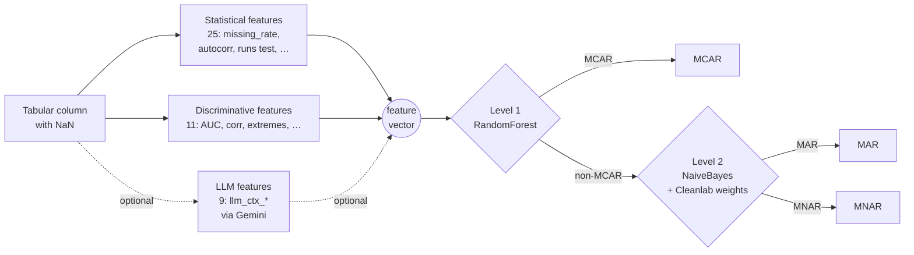

# missdetect

**Hierarchical classification of missing-data mechanisms (MCAR / MAR / MNAR) with statistical and LLM-augmented features.**

[](LICENSE)
[](https://www.python.org/downloads/)
[](https://github.com/astral-sh/ruff)

> 🇧🇷 [Versão em português](README.pt-BR.md)

Companion code for the master's thesis *"Hierarchical Classification of Missing
Data Mechanisms: A Statistical Feature Engineering Approach with LLM
Augmentation and Real-World Validation"* (Jonathan Tsen, ITA, 2026).

---

## TL;DR

Given a univariate column with missing values, classify whether the missingness
is **MCAR** (completely at random), **MAR** (depends on observed variables), or
**MNAR** (depends on the unobserved value itself). We compare a statistics-only
baseline against an LLM-augmented variant on 1,200 synthetic and 29 real
datasets, using a hierarchical two-level classifier robust to label noise.

**Key finding:** LLM features contribute marginally to real-world accuracy
(+1.9pp with Gemini Pro, none with Flash). The hierarchical structure plus
Cleanlab-weighted Naive Bayes is what moves the needle. We document a
**provable ceiling** of ~60–65% (Rubin 1976 + measured 59.4% label noise) and
discuss the gap explicitly.

---

## Headline results

| Configuration | Real datasets | CV accuracy (Group 5-Fold) | Holdout | Cost |
|:--|:-:|:-:|:-:|:-:|
| **V3+ Hierarchical (peak)** — 23 datasets, 25 statistical features only | 23 | **55.97%** | 50.5% | $0 |
| Step 1 V2 Neutral — Pro + statistical, expanded benchmark | 29 | **49.33%** | 55.19% | ~$30 |
| Step 1 V2 Neutral — Flash + statistical | 29 | 47.44% | 51.14% | ~$3 |
| ML-only baseline (no LLM) | 29 | 47.47% | 53.92% | $0 |
| Random-class baseline | — | 33.3% | 33.3% | $0 |
| Theoretical ceiling (Rubin 1976 + measured noise) | — | ~60–65% | — | — |

NaiveBayes consistently beats RandomForest, GradientBoosting, MLP and SVM by
+6 to +13pp under cross-validation — calibration of uncertainty matters more
than model capacity in this label-noisy regime.

See [`docs/HISTORICO.md`](docs/HISTORICO.md) for the full experimental log
across the 7 phases of the project.

---

## Why this is interesting

To our knowledge, this is the **first** study combining LLM-derived domain
features with hierarchical classification for the MCAR / MAR / MNAR problem.
Prior work either tests MCAR vs everything (PKLM, Little's test) or relies on
purely statistical features (MechDetect). The negative result on LLM features
in real noisy data — which we believe is publishable — and the documented
gap between synthetic ceiling (~80%) and real-world ceiling (~60%) are both
contributions worth reporting.

A theoretical caveat: under the Molenberghs et al. (2008) impossibility
result, every MNAR model has an MAR counterpart with identical observed-data
fit. Perfect MAR/MNAR separation is therefore unachievable from observed data
alone — our 49–56% range should be read against that ceiling, not against
chance.

---

## Repository layout

```
.
├── src/missdetect/         # Python package (installable)
│   ├── extract_features.py # Feature extraction pipeline
│   ├── train_model.py      # Single-level classifiers
│   ├── train_hierarchical_v3plus.py   # V3+ Cleanlab + soft3zone routing
│   ├── run_all.py          # End-to-end orchestrator
│   ├── features/           # Statistical + discriminative + MechDetect features
│   ├── llm/                # LLM-augmented extractors (judge, context-aware, …)
│   ├── baselines/          # MechDetect (Le et al. 2024), PKLM (Sportisse 2024)
│   ├── data_generation/    # mdatagen-based synthetic generator + real-data prep
│   └── metadata/           # Dataset metadata used by LLM prompts
│
├── data/                   # Datasets (see data/README.md)
│   ├── synthetic/          # 1,200 generated series (MCAR/MAR/MNAR × 12 variants)
│   └── real/               # 29 curated columns from UCI / OpenML / Kaggle
│       ├── raw/            # Original CSVs
│       ├── processed/      # Bootstrapped per-mechanism series used in experiments
│       └── sources.md      # Provenance and licence per dataset
│
├── results/                # Reproducible experiment outputs
│   ├── step1_v2_neutral/   # Latest: 29 datasets, Pro + neutral metadata
│   ├── step05_pro/         # Peak V3+ result on 23 datasets
│   └── _archive/           # Historical experiments (gitignored — zip on request)
│
├── docs/                   # Documentation
│   ├── HISTORICO.md        # Master narrative across 7 phases (PT-BR)
│   ├── methodology.md      # Methodology summary (EN)
│   ├── reproducibility.md  # Step-by-step replay of the headline experiments
│   ├── bibliography.md     # Annotated bibliography organised by topic
│   ├── code/               # Internal code-level documentation
│   └── archive/            # 76 dated planning / decision notes (PT-BR)
│
├── tests/                  # Smoke tests
├── pyproject.toml          # Modern packaging (PEP 517/518) + ruff/mypy/pytest config
├── LICENSE                 # MIT
├── CITATION.cff            # GitHub-readable citation metadata
└── README.md               # This file
```

---

## Quickstart

Requires Python 3.11+. We recommend [`uv`](https://docs.astral.sh/uv/) but any
PEP 517 builder works.

```bash
# 1. Clone & enter
git clone https://github.com/JonathanTsen/missdetect.git
cd missdetect

# 2. Install (uv)
uv venv
source .venv/bin/activate
uv pip install -e ".[boosting,llm]"

# 2b. Install (vanilla pip, alternative)
python -m venv .venv && source .venv/bin/activate
pip install -e ".[boosting,llm]"

# 3. (Optional) Provide LLM credentials in a .env file
cat > .env <<'ENV'
GEMINI_API_KEY=...
OPENAI_API_KEY=...
ENV
```

### Run the headline experiment (statistics-only baseline)

```bash
# Extract features from synthetic data (no LLM, ~5 min)
missdetect-extract --model none --data synthetic

# Train the seven classifiers with Group-aware CV
missdetect-train --model none --data synthetic
```

### Replay the V3+ peak experiment (23 real datasets, no LLM)

```bash
missdetect-extract --model none --data real --metadata-variant neutral
python -m missdetect.train_hierarchical_v3plus \
  --model none --data real \
  --experiment step05_pro
```

### Replay Step 1 V2 Neutral (29 datasets, Pro + LLM)

```bash
# Requires GEMINI_API_KEY and ~$30 in API budget
missdetect-extract \
  --model gemini-3-pro-preview \
  --llm-approach context_aware \
  --metadata-variant neutral \
  --data real

missdetect-train \
  --model gemini-3-pro-preview \
  --data real \
  --experiment step1_v2_neutral
```

See [`docs/reproducibility.md`](docs/reproducibility.md) for the full set of
commands, expected wall-clock times, and validation hashes.

---

## Methodology in one diagram



Detailed methodology: [`docs/methodology.md`](docs/methodology.md).

---

## Data

The 29 real datasets are curated columns from public benchmarks: 14 from
**UCI ML Repository**, 12 from **OpenML**, 2 from **Kaggle**, 3 from R
packages (`naniar`, `datasets`, `Ecdat`). Provenance, licence, and the
mechanism-labelling justification for each column is documented in
[`data/real/sources.md`](data/real/sources.md).

Synthetic data is regenerable on demand via
[`mdatagen`](https://pypi.org/project/mdatagen/) using the seeds and
configurations recorded in `src/missdetect/metadata/synthetic_variants_metadata.json`.

---

## Limitations

This README and the accompanying thesis make four limitations explicit:

1. **MAR / MNAR are theoretically inseparable** from observed data alone
   (Molenberghs et al. 2008). The 49–56% range we report reflects this
   information-theoretic ceiling — not a modelling failure.
2. **Label noise** in our real benchmark is high: 59.4% of bootstrap samples
   are flagged by Cleanlab as potentially mislabelled. The labels are domain
   experts' best guess, not ground truth.
3. **LLM features add little** in the real-data regime once statistical
   features have done their work. Gemini Pro is +1.9pp at ~10× Flash's cost;
   Flash is Pareto-dominated by the statistics-only baseline.
4. **Variance is high** under Group 5-Fold CV (±14–27pp) — six classes of
   real-world dataset can dominate which datasets land in train vs test, and
   averaging over more seeds is expensive when LLM is in the loop.

---

## Citation

If you use this code or the experimental results, please cite both the
software and the thesis. GitHub renders the [`CITATION.cff`](CITATION.cff)
file directly; for BibTeX:

```bibtex
@mastersthesis{tsen2026missdetect,
  title  = {Hierarchical Classification of Missing Data Mechanisms:
            A Statistical Feature Engineering Approach with LLM Augmentation
            and Real-World Validation},
  author = {Tsen, Jonathan},
  school = {Instituto Tecnológico de Aeronáutica (ITA)},
  year   = {2026},
  url    = {https://github.com/JonathanTsen/missdetect}
}

@software{tsen2026missdetect_software,
  author  = {Tsen, Jonathan},
  title   = {missdetect: Hierarchical Classification of Missing-Data Mechanisms},
  year    = {2026},
  version = {0.1.0},
  url     = {https://github.com/JonathanTsen/missdetect}
}
```

---

## License

[MIT](LICENSE) © 2026 Jonathan Tsen.

The bundled real datasets are redistributed under their original licences
(UCI MLR / OpenML / Kaggle) — see [`data/real/sources.md`](data/real/sources.md).

---

## Acknowledgements

This work was developed as part of a master's program at the Instituto
Tecnológico de Aeronáutica (ITA), São José dos Campos, Brazil. We thank the
maintainers of [`mdatagen`](https://github.com/lazyresearch/mdatagen),
[`missmecha-py`](https://github.com/missmecha/missmecha-py), and
[`cleanlab`](https://github.com/cleanlab/cleanlab) — the project would not
have been feasible without them.
