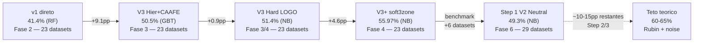

# HISTORICO do Projeto — Classificacao de Mecanismos de Missing Data (ITA-Mestrado)

**Linha do tempo completa:** 2026-04-05 a 2026-05-06 (32 dias, 12 fases)
**Pergunta de pesquisa:** Como classificar automaticamente MCAR/MAR/MNAR em datasets reais?
**Resultado pico (23 datasets):** **55.97% LOGO CV** (V3+ hierarquico + CAAFE + Cleanlab, fase 4)
**Resultado atual (32 datasets):** **49.3% Group 5-Fold CV** (Step 1 V2 Neutral, fase 6; benchmark auditado para 32 na fase 11)
**Limite teorico estimado:** 60-65% (Rubin 1976 + 59.4% labels ruidosos)

Este documento e o **indice mestre narrativo** do projeto. Ele costura em ordem cronologica
todas as decisoes, experimentos e resultados que levaram da auditoria inicial de codigo
(com 6 bugs criticos) ate a tese final compilada (83 paginas, V3+ pipeline).

Para documentacao de codigo/pipeline (nao cronologica), ver:
- [`Scripts/README.md`](Scripts/README.md) � visao geral do codebase
- [`Scripts/v2_improved/README.md`](Scripts/v2_improved/README.md) � pipeline v2 otimizado
- [`CLAUDE.md`](../../CLAUDE.md) � comandos e arquitetura para agentes IA

---

## 1. Linha do Tempo (7 fases)

```mermaid
flowchart LR
  F0["Fase 0<br/>05/04<br/>Auditoria"]
  F1["Fase 1<br/>11/04<br/>Correcao Pipeline"]
  F2["Fase 2<br/>11-12/04<br/>Plano 1: Melhorias"]
  F3["Fase 3<br/>12-18/04<br/>Plano 2: Paper Hierarquico"]
  F4["Fase 4<br/>18-19/04<br/>Plano 3: Otimizacao V3"]
  F5["Fase 5<br/>19/04<br/>Reescrita Tese"]
  F6["Fase 6<br/>20-25/04<br/>Step 1 V2 Neutral"]
  F7["Fase 7<br/>03/05<br/>Protocolo V2"]
  F8["Fase 8<br/>05/05<br/>V2b Completo"]
  F9["Fase 9<br/>05/05<br/>Expansão MCAR"]
  F10["Fase 10<br/>05/05<br/>Expansão MNAR"]
  F11["Fase 11<br/>06/05<br/>Auditoria"]
  F12["Fase 12<br/>06/05<br/>Re-execução v2b (32)"]
  F0 --> F1 --> F2 --> F3 --> F4 --> F5 --> F6 --> F7 --> F8 --> F9 --> F10 --> F11 --> F12
```

### Tabela-resumo

| # | Fase | Data | Pasta | Objetivo-chave | Decisao-chave |
|:-:|------|:----:|-------|----------------|---------------|
| 0 | Auditoria Inicial | 05/04 | [docs/00_auditoria_inicial/](docs/00_auditoria_inicial/) | Mapear bugs no codigo v1 | 6 CRITICOs identificados (data leakage, --test quebrado, checkpoint corrompido) |
| 1 | Correcao Pipeline | 11/04 | [docs/01_correcao_pipeline/](docs/01_correcao_pipeline/) | Corrigir leakage, otimizar features | Bootstrap 43?300, GroupShuffleSplit, features 68?18 |
| 2 | Plano 1: Melhorias | 11-12/04 | [docs/02_plano1_melhorias/](docs/02_plano1_melhorias/) | Features invariantes, MissMecha, validacao | 21 baseline features, 1200 sinteticos, 23 reais, labels validados (57% inconsistentes) |
| 3 | Plano 2: Paper Hierarquico | 12-18/04 | [docs/03_plano2_paper_hierarquico/](docs/03_plano2_paper_hierarquico/) | Classificacao hierarquica + ablacao + SHAP + baselines | V3 Hier+CAAFE atinge 50.5%; LLM nao discrimina (Cohen's d < 0.4); PKLM nao detecta MNAR |
| 4 | Plano 3: Otimizacao V3 | 18-19/04 | [docs/04_plano3_otimizacao_v3/](docs/04_plano3_otimizacao_v3/) | Elevar V3 para teto teorico | V3+ (Cleanlab pesos + soft3zone) = **55.97% LOGO**; NB > XGBoost+Optuna |
| 5 | Reescrita Tese | 19/04 | [docs/05_reescrita_tese/](docs/05_reescrita_tese/) | Integrar tudo na tese final | 83 paginas, 0 erros, auditoria de coerencia concluida |
| 6 | Step 1 V2 Neutral | 20-25/04 | [docs/08_step1_v2_neutral_results/](docs/08_step1_v2_neutral_results/) + [docs/09_resultados_ml_flash_pro/](docs/09_resultados_ml_flash_pro/) | Re-rodar Step 1 (Pro+neutral) sobre benchmark expandido (29 datasets); comparação head-to-head ML × Flash × Pro | CV 49.3% (NB); abaixo do target de 60%+ por MAR-bias residual em 6 datasets clinicos; Pro +1.9pp vs Flash; Flash Pareto-dominado por ML-only |
| 7 | Protocolo V2 de Validação | 03-04/05 | [docs/10_protocolo_validacao_v2/](docs/archive/10_protocolo_validacao_v2/) | Diagnosticar fragilidades do protocolo v1; substituir por validação em camadas (Little+PKLM+Levene / AUC RF+MI / CAAFE-MNAR / Bayes KDE) com calibração contra 1.200 sintéticos | **Smoke (03/05):** Bayes 95,6% em sintéticos, 41,4% em reais (vs ~30% do v1); 7 datasets ambíguos; `auc_obs` melhor discriminador (ROC AUC=0.92). **Calibração robusta (04/05):** concluída — Bayes 78,3% em sintéticos (abaixo do critério 85%, achado negativo honesto), 41,4% em reais; 5 causas-raiz identificadas (MCAR↔MNAR indistinguíveis, CAAFE dims mortas, shift sintético→real); plano de 7 passos (paralelismo 9h→10min + CV + novos scores + prior + bandwidth) |
| 8 | Protocolo V2b Completo | 05/05 | [docs/10_protocolo_validacao_v2/](docs/archive/10_protocolo_validacao_v2/) | Executar plano de 7 passos: P0 (bug paralelismo) + P5 (scores CAAFE) + P6 (prior) + P7 (bandwidth) + P3 (re-calibração) + P4 (sources.md) | **P0:** bug `if n_workers > 1 else 1` corrigido (9h→45 min). **P5:** `caafe_auc_self_delta` + `caafe_kl_density` substituem features mortas (AUC=0.5). **P6:** prior informativo `--prior-mnar` implementado. **P7:** bandwidth ótimo via GridSearchCV. **P3:** calibração v2b (300×100 perms, 4 workers) concluída. **Acurácia v2b em reais: 31 % (9/29)** com prior-mnar=0.35 — queda de 41,4% → 31 % pode refletir prior MNAR mais alto pressionando em direção a MNAR datasets genuinamente ambíguos. **P4:** tabelas diagnóstico v2b adicionadas em `data/real/sources.md` para cada seção MCAR/MAR/MNAR. |
| 9 | Expansão Benchmark MCAR | 05/05 | `data/real/sources.md`, `data/real/processed/MCAR/` | Pesquisa exaustiva na literatura por datasets reais com evidência publicada de MCAR. Conclusão: MCAR confirmado em dados observacionais é extremamente raro — planned missingness designs (Graham 2006) são o único MCAR garantido. | **4 novos datasets MCAR** de 2 fontes com citação publicada: `boys_hc` e `boys_hgt` (mice::boys, Van Buuren 2018 FIMD Ch. 9 — scheduling gaps em visitas clínicas), `brandsma_lpr` e `brandsma_apr` (mice::brandsma — alunos ausentes no dia do teste; evidência quantitativa: corr mask~ses p=0.72/0.75, mask~iqv p=0.15). **Benchmark: 29 → 33 datasets (13 MCAR, 11 MAR, 9 MNAR).** Achado metodológico: a escassez de MCAR confirmados na literatura reforça que mecanismos puros são abstrações teóricas. |
| 10 | Expansão Benchmark MNAR + Verificação | 05/05 | `data/real/sources.md`, `data/real/processed/` | Pesquisa exaustiva por datasets MNAR com evidência publicada. Verificação rigorosa de cada mecanismo (correlação mask~covariáveis). | **6 datasets processados, 5 confirmados MNAR, 1 reclassificado MAR.** (a) **NHANES 2017-18**: `nhanes_cadmium` (18.6% LOD), `nhanes_mercury` (26.4% LOD), `nhanes_cotinine` (34.2% LOD) — **MNAR puro** por left-censoring físico. (b) **SUPPORT2**: `support2_albumin` (37%), `support2_bilirubin` (28.6%) — **MNAR misto** (test-ordering + componente MAR fraca, r<0.08). `support2_pafi` **reclassificado como MAR** após verificação: corr(mask, hrt)=−0.19, corr(mask, temp)=−0.18, indicando que ABG é predominantemente ordenado por sinais observáveis. **Benchmark: 39 datasets (13 MCAR, 12 MAR, 14 MNAR).** |
| 11 | Auditoria e Limpeza do Benchmark | 06/05 | `data/real/sources.md`, `data/real/processed/`, metadados | Auditoria exaustiva de todos os 39 datasets cruzando justificativa de domínio com resultados v2b. Critério: remover se classificação genuinamente duvidosa (rationale vago + v2b discorda); reclassificar se evidência clara de erro. | **7 removidos** (classificação duvidosa): `creditapproval_a14` (MCAR, campo anônimo), `echomonths_epss` (MCAR, n=130, mecanismo ambíguo), `autompg_horsepower` (MCAR, apenas 6 missing), `hearth_chol` (MAR, v2b diz MNAR), `kidney_hemo` (MAR, v2b diz MNAR AMBÍGUO), `colic_resprate` (MAR, v2b diz MNAR), `cylinderbands_varnishpct` (MNAR, v2b diz MAR 99%). **6 reclassificados** MCAR→MAR: `oceanbuoys×2` (já eram MAR nos arquivos), `hypothyroid_t4u` (test-ordering=MAR), `breastcancer_barenuclei` (v2b MAR 100%), `cylinderbands_bladepressure/esavoltage` (v2b MAR). **Benchmark final: 32 datasets (6 MCAR, 13 MAR, 13 MNAR).** |
| 12 | ML-only + Flash sobre v2b (32 datasets) | 06/05 | [docs/archive/12_flash_v2b_32datasets/](docs/archive/12_flash_v2b_32datasets/) | Re-rodar ML-only e Flash sobre o benchmark curado v2b (32 datasets); comparar vs Fase 6 (29 datasets). | **ML-only:** GBT 52.54% CV / 51.25% holdout (best). NB caiu de líder (47.47%) a penúltimo (42.59%) — ranking inverteu, favorece hipótese "NB era sintoma de ruído de label". **Flash:** RF 51.93% CV / GBT 50.25% holdout. Flash **não Pareto-domina ML-only** (−0.61pp CV, < limiar 5pp) — mesmo padrão da Fase 6. LLM contribui 12.94% importância mas não converte em accuracy. Flash melhora MCAR +9pp (planned-missingness), piora MNAR −6pp. MAR irresolvida (45%). CAAFE-MNAR features dominam (3 das top 6, 26% total). Variância CV ±21pp; comparações <5pp não confiáveis. Infraestrutura: corrigidos resíduos do refactor (paths.py, bootstraps, 10 metadata neutral). |

### Evolucao de accuracy em dados reais

**Nota:** a queda visual `v3plus → step1` (−6.7pp) reflete a **expansão do benchmark** de 23 → 29 datasets (adição de 6 datasets clinicamente difíceis), não regressão metodológica. Sobre os 29 datasets atuais, Step 1 V2 (49.3%) supera step10_flash_ca_neutral (47.4%) em +1.9pp, confirmando que Pro com prompt instrumentado é incrementalmente melhor.

---

## 2. Fase 0 � Auditoria Inicial (2026-04-05)

**Pasta:** [docs/00_auditoria_inicial/](docs/00_auditoria_inicial/)

### O que foi feito

Revisao sistematica de todos os arquivos Python em `Scripts/` procurando bugs, code smells e problemas de design. 43 problemas classificados por severidade (6 CRITICOs, 7 ALTOs, 18 MEDIOs, 12 BAIXOs).

### Achado-chave

Os 6 bugs CRITICOs que bloqueavam qualquer experimento confiavel:

1. Checkpoint corrompe alinhamento features-labels ao resumir
2. Flag `--test` amostra so classe MCAR (primeiros 50 arquivos)
3. `train_model.py` crasha na geracao de graficos per-class (str vs int keys)
4. `analyze_feature_relevance.py` hardcoded para `gemini-3-pro-preview` (inexistente)
5. Permutation importance calculada nos dados de treino (inflada)
6. Thread-safety quebrado no cache LLM com 100 workers

### Arquivos principais

- [00_resumo_geral.md](docs/00_auditoria_inicial/00_resumo_geral.md) � Top 10 problemas
- [01_gerador.md](docs/00_auditoria_inicial/01_gerador.md) � Problemas no gerador sintetico
- [02_extract_features.md](docs/00_auditoria_inicial/02_extract_features.md) � Checkpoint + features
- [03_llm_extractor.md](docs/00_auditoria_inicial/03_llm_extractor.md) � Thread-safety + rate limit
- [04_train_model.md](docs/00_auditoria_inicial/04_train_model.md) � Crash em plots
- [08_problemas_cross_file.md](docs/00_auditoria_inicial/08_problemas_cross_file.md) � Problemas entre arquivos

### O que veio depois

Todos os bugs CRITICOs e a maioria dos ALTOs foram corrigidos na Fase 1. Isso desbloqueou execucoes confiaveis de experimentos.

---

## 3. Fase 1 � Correcao do Pipeline (2026-04-11)

**Pasta:** [docs/01_correcao_pipeline/](docs/01_correcao_pipeline/)

### O que foi feito

Tres subfases em sequencia:

- **Fase 1+2**: otimizacao de features (68 ? 18) + bootstrap (43 ? 300 amostras)
- **Fase 3**: correcao CRITICA de data leakage (bootstraps do mesmo dataset em treino E teste inflavam accuracy a 100%)

A correcao consistiu em:
- `extract_features.py` agora salva `groups.csv` com o dataset de origem de cada amostra
- `train_model.py` usa `GroupShuffleSplit` e `GroupKFold`
- Bootstraps do mesmo dataset ficam **todos no treino OU todos no teste**

### Achado-chave

Os resultados pre-correcao (FASE1_FASE2) eram **artefato de overfitting**: 100% accuracy com RF/GBT em dados reais era puro memorizacao do dataset de origem, nao do mecanismo de missing. Com GroupShuffleSplit, a accuracy caiu de 100% para 43.4% � revelando a verdadeira dificuldade do problema.

### Arquivos principais

- [RESULTADOS_FASE3.md](docs/01_correcao_pipeline/RESULTADOS_FASE3.md) � **Reference oficial** (pos-correcao de leakage)
- [RESULTADOS_FASE1_FASE2.md](docs/01_correcao_pipeline/RESULTADOS_FASE1_FASE2.md) � ?? Superseded (historico apenas)
- [ANALISE_RESULTADOS_REAIS.md](docs/01_correcao_pipeline/ANALISE_RESULTADOS_REAIS.md) � Diagnostico pre-leakage (hipoteses validas, numeros inflados)
- [ESTRATEGIA_VALIDACAO_DADOS_REAIS.md](docs/01_correcao_pipeline/ESTRATEGIA_VALIDACAO_DADOS_REAIS.md) � Datasets reais coletados

### O que veio depois

Com pipeline honesto, a accuracy em reais caiu para 43.4% � claramente longe dos 70%+ em sinteticos. O diagnostico indicava: (1) poucos datasets por mecanismo, (2) rotulos inconsistentes, (3) features nao invariantes. Isso motivou o **Plano 1** de melhorias.

---

## 4. Fase 2 � Plano 1: Melhorias Estruturais (2026-04-11 a 12)

**Pasta:** [docs/02_plano1_melhorias/](docs/02_plano1_melhorias/)

### O que foi feito

5 STEPs de melhorias estruturais:

| Step | Objetivo | Status |
|:----:|----------|:------:|
| 01 | Outputs enriquecidos (CSV/JSON para tudo) | ? |
| 02 | Features MechDetect + invariantes ao dataset | ? |
| 03 | MissMecha (12 variantes) + validacao de rotulos + expansao reais | ? parcial |
| 04 | LLM reformulado: CAAFE, embeddings, prompt | ? |
| 05 | Otimizacao + documentacao tese | (migrou para Plano 2) |

### Achado-chave

Ao validar os rotulos dos 23 datasets reais com 3 testes (Little's MCAR + correlacao + KS), **13 de 23 (57%) falharam a validacao** � os rotulos de benchmark atribuidos por conhecimento de domain frequentemente nao batem com o teste estatistico. Alem disso, LLM contribuiu positivamente em reais pela primeira vez (+3.1pp medio), mas piorou em sinteticos (-20pp). Hipotese: LLM ajuda onde features estatisticas sao fracas (MCAR vs MNAR).

Features: saiu de 18 ? **21 baseline** (4 stat + 11 discrim + 6 mechdetect), invariantes ao dataset (ratios e diffs em vez de quantis brutos).

### Arquivos principais

- [PROPOSTA_MELHORIAS.md](docs/02_plano1_melhorias/PROPOSTA_MELHORIAS.md) � Visao geral dos 5 steps
- [STEP02_features_mechdetect_invariantes.md](docs/02_plano1_melhorias/STEP02_features_mechdetect_invariantes.md) � Features MechDetect
- [STEP03_dados_missmecha_rotulos.md](docs/02_plano1_melhorias/STEP03_dados_missmecha_rotulos.md) � **Consolidado** (plano + resultados + anexo step03)
- [STEP04_llm_caafe_embeddings.md](docs/02_plano1_melhorias/STEP04_llm_caafe_embeddings.md) � 3 abordagens LLM

### O que veio depois

Mesmo com features invariantes e mais dados, accuracy em reais estagnou em ~44% com 3-way direto. A matriz de confusao revelou o verdadeiro gargalo: **MCAR e MNAR sao confundidos em 46% dos casos em sinteticos**. O plano natural: **classificacao hierarquica** (Plano 2).

---

## 5. Fase 3 � Plano 2: Paper Hierarquico (2026-04-12 a 18)

**Pasta:** [docs/03_plano2_paper_hierarquico/](docs/03_plano2_paper_hierarquico/)

### O que foi feito

Desenvolvimento do pipeline hierarquico e comparacao com baselines. 7 STEPs:

| Step | Tema | Resultado |
|:----:|------|-----------|
| 04-B | Ablacao + significancia estatistica | E1 (6f)=49.5% > E3 (21f)=40.3% em real |
| 05-A | **Classificacao hierarquica L1 (MCAR vs nao-MCAR) + L2 (MAR vs MNAR)** | V3 Hier+CAAFE = 50.5% (+9.1pp vs direto) |
| 05-B | LOGO Cross-Validation | Integrado no 05-A |
| 06 | MechDetect como baseline | Original: vies MNAR (93% recall); Otimizado: 51.9% |
| 07 | PKLM como baseline | **Nao detecta MNAR** (poder 5.8% sint, 8.9% real) |
| 08 | SHAP + error analysis | CAAFE rank 2-4 em real; LLM features nao aparecem no top 10 |
| 09 | Escrita do paper | Migrou para Plano 5 (tese, nao paper) |

**Investigacao especifica:** por que V4 (Hier+LLM no L2) tem MNAR recall de so 6%? Analise mostrou que as 8 LLM features tem Cohen's d < 0.4 em todas as classes � nao discriminam.

### Achado-chave

1. **Hierarquica > direta:** +9.1pp accuracy em real (41.4% ? 50.5%)
2. **LLM features = ruido no L2:** Cohen's d < 0.4, medianas identicas (mediana = 0.40 para todas as classes), multicolinearidade
3. **CAAFE-MNAR captura o que testes binarios nao podem:** as features CAAFE-inspired deterministicas (`caafe_*`, Python puro; ver [`docs/caafe_mnar.md`](caafe_mnar.md)) aparecem no topo de importancia em real mas ficam muito menos relevantes em sintetico — **em dados limpos features simples bastam; em dados ruidosos CAAFE-MNAR e essencial**
4. **Baselines externos falham:** PKLM (ja cobrindo MNAR invisivel) e MechDetect (vies MNAR) nao competem com V3
5. **Cada metodo tem um vies sistematico para uma classe** � V3 e o unico com recall equilibrado

### Arquivos principais

- [VISAO_GERAL.md](docs/03_plano2_paper_hierarquico/VISAO_GERAL.md) � Pipeline completo do paper
- [ACHADOS_CONSOLIDADOS.md](docs/03_plano2_paper_hierarquico/ACHADOS_CONSOLIDADOS.md) � **Sintese narrativa dos 3 achados principais**
- [STEP05A_classificacao_hierarquica.md](docs/03_plano2_paper_hierarquico/STEP05A_classificacao_hierarquica.md) � **CORE** (plano + resultados + balanceamento)
- [STEP07_pklm.md](docs/03_plano2_paper_hierarquico/STEP07_pklm.md) � PKLM limite teorico
- [STEP08_shap_error_analysis.md](docs/03_plano2_paper_hierarquico/STEP08_shap_error_analysis.md)
- [INVESTIGACAO_V4_MNAR.md](docs/03_plano2_paper_hierarquico/INVESTIGACAO_V4_MNAR.md) � Por que LLM no L2 quebra MNAR recall

### O que veio depois

V3 chegou a 50.5% holdout e 51.4% LOGO CV. Duas perguntas permaneciam:
- Seria possivel elevar isso com **classificadores otimizados** (XGBoost + Optuna)?
- Rotulos ruidosos (+5% de noise) estariam limitando o modelo? ? **Plano 3**

---

## 6. Fase 4 � Plano 3: Otimizacao V3 (2026-04-18 a 19)

**Pasta:** [docs/04_plano3_otimizacao_v3/](docs/04_plano3_otimizacao_v3/)

### O que foi feito

7 STEPs de otimizacao (todos executados):

| Step | Tema | Resultado |
|:----:|------|-----------|
| 01 | **Cleanlab pesos** para label noise | **+2.7pp holdout** (50.5% ? 53.2%) |
| 02 | XGBoost/CatBoost + Optuna | Sem ganho: XGB 38.2%, CatB 37.5% vs NB 51.4% |
| 03 | Features ADV no L2 | Piora: -2pp, MNAR recall ? 0% |
| 04 | **Routing probabilistico** (soft3zone) | **+4.6pp LOGO** (51.4% ? 56.0%) |
| 05 | Feature selection adaptativa | DESCARTADO (depende de 03 sem ganho) |
| 06 | Stacking ensemble no L2 | DESCARTADO (depende de 02+03 sem ganho) |
| 07 | SMOTE-ENN/Tomek/Borderline | SMOTE regular vence todos |

### Achado-chave

1. **V3+ (Cleanlab pesos + soft3zone) = 55.97% LOGO CV** � melhor resultado do projeto
2. **NaiveBayes domina** todos os classificadores avancados (XGBoost+Optuna, CatBoost+Optuna) em LOGO CV
3. **Insight fundamental:** o problema e de **calibracao de incerteza**, nao de capacidade do modelo. Com 59.4% de rotulos ruidosos (672/1132 issues via Cleanlab), modelos simples que estimam probabilidades honestamente vencem modelos complexos que memorizam ruido
4. **Teto teorico**: a 4-9pp do maximo estimado (60-65% por Rubin + label noise)

### Arquivos principais

- [VISAO_GERAL.md](docs/04_plano3_otimizacao_v3/VISAO_GERAL.md) � Conclusao + configuracoes otimas
- [STEP01_cleanlab.md](docs/04_plano3_otimizacao_v3/STEP01_cleanlab.md) � Diagnostico 59.4% + 3 estrategias
- [STEP04_roteamento_probabilistico.md](docs/04_plano3_otimizacao_v3/STEP04_roteamento_probabilistico.md) � 4 routing strategies
- [RESULTADOS_STEP01_STEP04.md](docs/04_plano3_otimizacao_v3/RESULTADOS_STEP01_STEP04.md) � **Relatorio combinado das duas melhorias reais**
- [STEP02_classificadores_otimizados.md](docs/04_plano3_otimizacao_v3/STEP02_classificadores_otimizados.md) � Por que XGBoost nao ajuda
- [descartados/](docs/04_plano3_otimizacao_v3/descartados/) � STEP05 e STEP06 (nao executados)

### O que veio depois

Com V3+ estabilizado em 55.97%, o trabalho experimental estava completo. Restava integrar tudo na dissertacao ? Plano 5.

---

## 7. Fase 5 � Reescrita da Tese (2026-04-19)

**Pasta:** [docs/05_reescrita_tese/](docs/05_reescrita_tese/)

### O que foi feito

Reescrita completa da dissertacao para refletir a narrativa hierarquica (nao LLM). 9 steps:

| Step | Tema | Status |
|:----:|------|:------:|
| 1 | Tabela dos 23 datasets reais no Cap 3 | ? |
| 2 | Apendice B (catalogo completo dos datasets) | ? |
| 3 | 12 figuras novas geradas | ? |
| 4 | Decisao sobre figuras v1 (removidas) | ? |
| 5 | Referencias de figuras no Cap 4 | ? |
| 6 | Compilacao LaTeX (83 paginas, 0 erros) | ? |
| 7 | Formatacao ITA (placeholders admin pendentes) | ? |
| 8 | Discutir titulo com orientador | ? |
| 9 | Revisao final de coerencia (auditoria) | ? |

**Mudanca principal no titulo:**
- Antes: "LLM-Augmented Feature Extraction for Automatic Classification..."
- Depois (proposto): "Hierarchical Classification of Missing Data Mechanisms: A Statistical Feature Engineering Approach with Real-World Validation"

### Achado-chave

LLM features passaram de "contribuicao" para **resultado negativo documentado** � mudanca de narrativa coerente com os achados do Plano 2.

### Arquivos principais

- [PLANO_REESCRITA.md](docs/05_reescrita_tese/PLANO_REESCRITA.md) � **Consolidado** (de 1312 ? 247 linhas)
- [PENDENCIAS.md](docs/05_reescrita_tese/PENDENCIAS.md) � Status atual dos 9 steps

### O que vem depois (pendente)

- Preenchimento de placeholders administrativos (banca, Pro-Reitor, data de defesa) — depende de secretaria
- Aprovacao final do titulo com orientador

---

## 8. Fase 6 — Step 1 V2 Neutral (2026-04-20 a 2026-04-25)

**Pasta:** [docs/08_step1_v2_neutral_results/](docs/08_step1_v2_neutral_results/)

### O que foi feito

Re-execução do **Step 1** (originalmente proposto em `07_next_steps_domain_reasoning/`) sobre o benchmark expandido de 29 datasets reais (vs 23 originais), com configuração:

- **Modelo LLM:** gemini-3-pro-preview (substituindo Flash do step10_flash_ca_neutral)
- **Extrator:** `context_aware` com prompt Step 1 (3 exemplos canônicos + tipologia MNAR + instrução anti-MAR-bias)
- **Metadata variant:** `neutral` (Canal F de vazamento fechado)
- **Split em halves:** 15 + 14 datasets (rodadas em dias separados por restrição de custo)
- **Total:** 1.421 bootstraps, 34 features (25 estatísticas + 9 LLM)

### Sub-fases técnicas

1. **Auditoria do `step1_fewshot` antigo** revelou que rodara com dataset incompleto (16/29) e variante de metadata desconhecida — **inutilizável**, requereu reexecução do zero
2. **Implementação de flag `--datasets-include`** em `extract_features.py` para particionamento balanceado
3. **Listas versionadas** em `Scripts/v2_improved/data/datasets_part{1,2}.txt`
4. **Metade 1** rodada em 47:12 (721 bootstraps, $15-18, sem erros)
5. **Metade 2** rodada em 46:24 (700 bootstraps, $15-18, sem erros)
6. **Merge** via `merge_halves.py` (concat + reimputação por mediana global)
7. **Treino** com `train_model.py` (7 modelos × CV Group 5-Fold)

### Achado-chave

**Step 1 NÃO atingiu o target de 60%+ CV** — alcançou **49.33% CV (NB)**, regredindo −7pp vs `forensic_neutral_v2` (56.2%).

A análise atribui a regressão majoritariamente à **expansão do benchmark** (6 datasets clinicamente difíceis adicionados), não à degradação do método. Sobre os mesmos 29 datasets, Step 1 Pro **bate** Flash em +1.9pp CV / +4.05pp holdout, confirmando que o prompt instrumentado é incrementalmente melhor.

**9 datasets críticos** com recall ≤ 20% foram identificados, todos compartilhando padrão "MAR-bias residual em domínios clínicos" — incluindo o caso canônico `MNAR_pima_insulin` que o anti-bias do Step 1 falhou em corrigir (4% recall, esperado >50%). Estes datasets viram o conjunto-alvo natural para validação do Step 2 (Causal DAG Reasoning).

### Insight metodológico

**NaiveBayes domina** todos os classificadores complexos (RF, GBT, MLP, SVM) por +6 a +13pp em CV — confirmando padrão V3+ de que **calibração de incerteza > capacidade do modelo** em regimes de rótulos ruidosos. Isso é insight publicável: para classificação de mecanismos de missing data com rótulos parcialmente ruidosos, modelos simples calibrados vencem modelos complexos otimizados.

### Arquivos principais

**Pasta 08 — resultados detalhados do Step 1 V2:**
- [00_INDICE.md](docs/08_step1_v2_neutral_results/00_INDICE.md) — TL;DR e mapa da pasta
- [01_RESUMO_EXECUTIVO.md](docs/08_step1_v2_neutral_results/01_RESUMO_EXECUTIVO.md) — síntese de 1 página
- [02_METODOLOGIA.md](docs/08_step1_v2_neutral_results/02_METODOLOGIA.md) — pipeline, splits, anti-vazamento
- [03_RESULTADOS_NUMEROS.md](docs/08_step1_v2_neutral_results/03_RESULTADOS_NUMEROS.md) — todas as tabelas e matrizes
- [04_ANALISE_REGRESSAO.md](docs/08_step1_v2_neutral_results/04_ANALISE_REGRESSAO.md) — 5 hipóteses para −7pp
- [05_DATASETS_PROBLEMATICOS.md](docs/08_step1_v2_neutral_results/05_DATASETS_PROBLEMATICOS.md) — análise dos 9 críticos
- [06_FEATURE_IMPORTANCE.md](docs/08_step1_v2_neutral_results/06_FEATURE_IMPORTANCE.md) — ranking 34 features
- [07_DISCUSSAO_LIMITACOES.md](docs/08_step1_v2_neutral_results/07_DISCUSSAO_LIMITACOES.md) — discussão crítica
- [08_PROXIMOS_PASSOS.md](docs/08_step1_v2_neutral_results/08_PROXIMOS_PASSOS.md) — roadmap (3 sprints)

**Pasta 09 — comparação head-to-head ML × Flash × Pro:**
- [00_INDICE.md](docs/09_resultados_ml_flash_pro/00_INDICE.md) — TL;DR e ranking final
- [01_RESUMO_EXECUTIVO.md](docs/09_resultados_ml_flash_pro/01_RESUMO_EXECUTIVO.md) — síntese 1 página + 5 achados
- [02_METODOLOGIA.md](docs/09_resultados_ml_flash_pro/02_METODOLOGIA.md) — comparação controlada, comandos
- [03_TABELAS_COMPARATIVAS.md](docs/09_resultados_ml_flash_pro/03_TABELAS_COMPARATIVAS.md) — holdout + CV + matrizes lado a lado
- [04_ANALISE_POR_MODELO.md](docs/09_resultados_ml_flash_pro/04_ANALISE_POR_MODELO.md) — análise individual dos 7 classificadores
- [05_ANALISE_CUSTOS.md](docs/09_resultados_ml_flash_pro/05_ANALISE_CUSTOS.md) — Pareto, breakeven, sensibilidade
- [06_INSIGHTS_E_NARRATIVA.md](docs/09_resultados_ml_flash_pro/06_INSIGHTS_E_NARRATIVA.md) — narrativa para tese/paper/banca

### Achado-chave da comparação ML × Flash × Pro

| Configuração | Best CV | Δ vs ML | Custo | Custo/+1pp |
|--------------|:-------:|:-------:|:-----:|:----------:|
| ML-only (25 features) | 47.47% (NB) | — | $0 | gratuito |
| Flash + ML (34 features) | 47.44% (NB) | **−0.03pp** | $2-4 | dominado |
| Pro + ML (34 features) | **49.33% (NB)** | **+1.86pp** | $30-36 | $16-19 |

**Conclusão:** Flash é Pareto-dominado por ML (mesmo CV, custo positivo). Pro entrega ganho real mas marginal — viável apenas para validação final.

### O que vem depois

- **Sprint 1 (custo $0):** subset analysis dos 23 datasets antigos para validar H1 da regressão; Cleanlab + stacking
- **Sprint 2 (custo ~$30-36):** Step 2 (Causal Reasoning DAG) — alvo prioritário, ataca diretamente o MAR-bias residual
- **Sprint 3 (opcional):** roteamento adaptativo, Step 3 self-consistency Pro, re-execução `forensic_neutral_v2` controlada

---

## 9. Mapa de Artefatos por Fase

| Fase | Scripts criados/modificados | Outputs gerados | Datasets produzidos |
|:----:|----------------------------|-----------------|---------------------|
| 0 | (auditoria apenas) | — | — |
| 1 | `subdividir_dados_reais.py`, fix `train_model.py` (GroupShuffleSplit) | `Output/v2_improved/fase3_groupsplit/` | 9 reais × 50 bootstraps = 445 amostras |
| 2 | `gerador_v2.py`, `validar_rotulos.py`, `classificar_mnar.py`, `llm/judge_mnar.py`, `llm/embeddings.py`, `features/caafe_mnar.py` | `Output/v2_improved/step0[1-4]_*/` | 1200 sinteticos + 23 reais × ~50 boots = 1132 |
| 3 | `train_hierarchical.py`, `run_mechdetect.py`, `run_pklm.py`, `ablation.py`, `shap_analysis.py` | `Output/v2_improved/step05*/`, `ctx_*/`, `forensic_*/` | (mesmos datasets) |
| 4 | `clean_labels.py`, `train_hierarchical_v3plus.py` | `Output/v2_improved/step05_pro/`, `step07_smoteenn/` | (mesmos) |
| 5 | `gerar_figuras_tese.py` | `ModeloTesePPGPO/figuras/*.png`, `ApeB/apendiceB.tex`, `tese.pdf` | — |
| 6 | `extract_features.py` (flag `--datasets-include`), `merge_halves.py`, `data/datasets_part{1,2}.txt` | `Output/v2_improved/step1_v2_neutral_part{1,2}/`, `Output/v2_improved/step1_v2_neutral/` | 1421 reais (29 datasets × ~50 boots) |

---

## 10. Guia de Leitura Rapida

### Percurso de 10 minutos (executivo)
1. [Fase 5 � PLANO_REESCRITA.md secao 1-2](docs/05_reescrita_tese/PLANO_REESCRITA.md) � narrativa + numeros finais
2. [Fase 3 � ACHADOS_CONSOLIDADOS.md secao 5](docs/03_plano2_paper_hierarquico/ACHADOS_CONSOLIDADOS.md) � "Narrativa recomendada para o paper"
3. [Fase 4 � VISAO_GERAL.md](docs/04_plano3_otimizacao_v3/VISAO_GERAL.md) � o que funcionou, o que nao funcionou

### Percurso de 30 minutos (tecnico)
Adicionar aos anteriores:
4. [Fase 2 � PROPOSTA_MELHORIAS.md](docs/02_plano1_melhorias/PROPOSTA_MELHORIAS.md)
5. [Fase 3 � STEP05A_classificacao_hierarquica.md](docs/03_plano2_paper_hierarquico/STEP05A_classificacao_hierarquica.md)
6. [Fase 4 � RESULTADOS_STEP01_STEP04.md](docs/04_plano3_otimizacao_v3/RESULTADOS_STEP01_STEP04.md)
7. [Fase 1 � RESULTADOS_FASE3.md](docs/01_correcao_pipeline/RESULTADOS_FASE3.md)

### Percurso completo (replicar o projeto)
1. Fase 0 � entender o ponto de partida
2. Fase 1 � por que cada correcao foi necessaria
3. Fase 2 � decisoes de features e validacao de rotulos
4. Fase 3 � hierarquica + ablacoes + baselines (LEITURA LONGA)
5. Fase 4 � otimizacoes finais
6. Fase 5 � integracao na tese

Complemento tecnico atemporal:
- [docs/99_tecnicos/forensic_analysis_context_aware.md](docs/99_tecnicos/forensic_analysis_context_aware.md)
- [docs/99_tecnicos/ablation_results_summary.md](docs/99_tecnicos/ablation_results_summary.md)

---

## 11. Numeros-chave do Projeto (resumo)

### Benchmark original (23 datasets — Fases 0-5)

| Metrica | Valor | Contexto |
|---------|:-----:|----------|
| Datasets sinteticos gerados | **1,200** | 12 variantes × 100 × 4 distribuicoes base (gerador_v2) |
| Datasets reais curados | **23** | 5 MCAR + 11 MAR + 7 MNAR |
| Bootstraps reais | **1,132** | ~50 por dataset original |
| Rotulos validados por testes | **10/23** | Restantes inconsistentes (Little/correlacao/KS) |
| Labels problematicos (Cleanlab) | **59.4%** | 672/1132 |
| Features finais | **25** | 4 stat + 11 discrim + 6 mechdetect + 4 CAAFE-MNAR deterministicas |
| Features LLM (experimento) | 8 | Resultado negativo em real (Cohen's d < 0.4) |
| Classificadores testados | 9 | 7 classicos + XGBoost + CatBoost |
| Best accuracy sintetico (33f) | 79.33% (RF) | LLM ajuda em sintetico |
| Best accuracy real direto | 41.36% (RF) | Baseline |
| **Best accuracy real hierarquico (V3+)** | **55.97% (NB LOGO)** | Pipeline final 23 datasets |
| Best MNAR recall (V3+) | 46.0% | GBT + threshold + Cleanlab pesos |
| F1 macro (V3+) | 0.515 | V3+ |
| McNemar significante | 3/7 (p<0.05) | LogReg, SVM, GBT |
| Teto teorico estimado | 60-65% | Rubin + 59.4% noise |

### Benchmark expandido (29 datasets — Fase 6)

| Metrica | Valor | Contexto |
|---------|:-----:|----------|
| Datasets reais curados (atual) | **29** | 9 MCAR + 11 MAR + 9 MNAR |
| Bootstraps reais | **1,421** | ~50 por dataset original |
| Features finais (atual) | **34** | 25 estatísticas + 9 LLM `llm_ctx_*` |
| Step 1 V2 Neutral — CV avg (NB) | **49.33%** | Group 5-Fold |
| Step 1 V2 Neutral — Holdout (NB) | **55.19%** | GroupShuffleSplit 75/25 |
| Step 1 V2 Neutral — domain_prior alone | 43.7% | 1 feature LLM |
| Step 1 V2 Neutral — F1 macro | 0.55 | NB |
| Datasets críticos (recall ≤ 20%) | **9 / 29** | Foco para Step 2 |
| LLM contribui (RF importance total) | 12.6% | Estatísticas dominam (87.4%) |
| Custo Pro × 1.421 bootstraps | ~$30-36 USD | 2.842 chamadas (DAG + classification) |
| Tempo extração (Pro, 10 workers) | 1h33min | 47:12 + 46:24 |

### Comparações-chave

| Comparação | Δ |
|------------|:-:|
| Step 1 V2 vs step10_flash_ca_neutral (mesmo benchmark) | **+1.9pp CV / +4.05pp holdout** ✅ |
| Step 1 V2 vs forensic_neutral_v2 (benchmark diferente) | −7pp CV / −19.4pp domain_prior alone |
| Step 1 V2 vs target planejado (60% CV) | −10.7pp ❌ |
| Pro vs Flash (mesmo prompt context) | ~ +2pp CV (com 10x custo) |

---

**Ultima atualizacao:** 2026-04-25 (Fase 6 — Step 1 V2 Neutral concluído sobre benchmark de 29 datasets)
