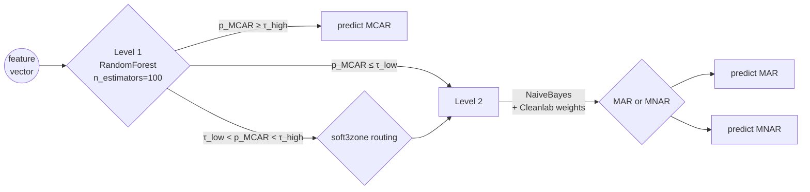

# Methodology

This document gives a self-contained overview of the missdetect methodology.
For the chronological narrative, see [`HISTORICO.md`](HISTORICO.md). For
detailed phase-by-phase decisions, see [`archive/`](archive/).

## 1. Problem statement

Given a tabular dataset and a target column with missing values, decide
whether the missingness mechanism is **MCAR**, **MAR**, or **MNAR** in the
sense of Rubin (1976):

- **MCAR** (Missing Completely At Random): `P(R | Y, X) = P(R)`
- **MAR** (Missing At Random): `P(R | Y, X) = P(R | X_obs)`
- **MNAR** (Missing Not At Random): `P(R | Y, X)` depends on `Y_mis`

where `R` is the missingness indicator, `Y` the variable of interest, `X` the
covariates, and `X_obs` the observed part of `X`.

Following Molenberghs et al. (2008), MAR and MNAR are not separable from the
observed-data law alone — every MNAR model has an MAR counterpart with
identical observed-data fit. The classification problem is therefore not a
test of a hypothesis but a *plausibility ranking* informed by domain priors
encoded as features.

## 2. Feature engineering

We extract four groups of features per dataset / column. The current
statistical-only configuration has 25 deterministic features: 4 basic
statistical, 11 discriminative, 6 MechDetect-style and 4 CAAFE-MNAR features.
LLM features are optional and are stored in separate `llm_*` / `llm_ctx_*`
columns.

### 2.1 Basic statistical features (4)

Capture simple distributional changes in the masked column `X0`:
`X0_missing_rate`, `X0_obs_vs_full_ratio`, `X0_iqr_ratio`,
`X0_obs_skew_diff`.

These features ask whether the observed part of `X0` still looks like a
neutral sample of the full column, or whether missingness has distorted the
mean, spread or skewness.

### 2.2 Discriminative features (11)

Designed to separate mechanisms statistically:

- `auc_mask_from_Xobs` — AUC of predicting the missingness indicator from
  the observed covariates. Elevated values suggest **MAR**.
- `little_proxy_score` — proxy for Little's MCAR test (1988).
- `X0_tail_missing_ratio` — missingness in the upper tail versus the centre
  of the imputed `X0` distribution. Elevated values suggest **MNAR**.
- `X0_censoring_score` — absolute rank correlation between imputed `X0` and
  the missingness mask; a proxy for self-censoring / self-masking.
- `log_pval_X1_mask`, `X1_mean_diff`, `X1_mannwhitney_pval` — whether `X1`
  differs between observed and missing rows, suggesting **MAR**.

### 2.3 MechDetect-style features (6)

These features compare how well the missingness mask can be predicted in
three tasks:

- `mechdetect_auc_complete` — uses imputed `X0` plus `X1..X4`.
- `mechdetect_auc_excluded` — uses only observed covariates `X1..X4`.
- `mechdetect_auc_shuffled` — negative control with the mask shuffled.
- `mechdetect_delta_complete_shuffled` and
  `mechdetect_delta_complete_excluded` — performance gaps between those
  tasks.
- `mechdetect_mwu_pvalue` — statistical comparison of complete versus
  shuffled AUCs.

If `X1..X4` predict the mask well, this supports **MAR**. If adding imputed
`X0` materially changes the prediction, this is indirect evidence for
**MNAR**.

### 2.4 CAAFE-MNAR features (4 deterministic, CAAFE-inspired)

The original CAAFE method of Hollmann, Müller & Hutter (NeurIPS 2023) is an
LLM-based automated feature-engineering loop: an LLM proposes Python code for
new features, the code is executed, and downstream validation decides whether
to keep it.

This repository does **not** reimplement the original CAAFE loop. Our
`caafe_*` columns are deterministic Python features inspired by CAAFE's
context-aware feature-engineering idea, specialised for the MAR-vs-MNAR
problem and computed without LLM calls at runtime. See
[`caafe_mnar.md`](caafe_mnar.md) for the canonical distinction.

Current CAAFE-MNAR features:

- `caafe_auc_self_delta` — improvement in mask-prediction AUC when imputed
  `X0` is added to `X1..X4`. If `X0` helps predict its own absence, this
  suggests **MNAR**.
- `caafe_kl_density` — divergence between the imputed-`X0` distribution in
  missing versus observed rows. Large divergence suggests selective
  missingness.
- `caafe_kurtosis_excess` — tail / truncation signal in the observed `X0`
  distribution.
- `caafe_cond_entropy_X0_mask` — normalised reduction in mask uncertainty
  after binning imputed `X0`; high values suggest the missingness mask varies
  with `X0`.

### 2.5 LLM features (8–9, optional)

Five extraction strategies are implemented in [`src/missdetect/llm/`](../src/missdetect/llm/):

| Strategy | Output features | Cost (per dataset) |
|:--|:-:|:-:|
| `extractor_v2` (original prompt) | 8 | $ |
| `judge_mnar` (binary MCAR vs MNAR) | 4 | $ |
| `embeddings` (sentence-transformers, local) | 10 | free |
| `context_aware` (DAG + counter-arguments — **Step 1**) | 9 | $$ |
| `self_consistency` (5 perspectives, CISC voting) | 8 | $$$ |

Each strategy returns a confidence vector for MCAR / MAR / MNAR plus
auxiliary scores (e.g. `llm_ctx_self_censoring`, `llm_ctx_domain_prior`).
The `context_aware` extractor uses dataset metadata (domain description,
column semantics) drawn from `src/missdetect/metadata/`. Two metadata
variants are available:

- `default` — includes mechanism-suggestive context (used in earlier
  experiments, mildly leaky).
- `neutral` — strips identifying domain hints to close information channel
  F. **Used in Step 1 V2 Neutral, the canonical experiment.**

## 3. Hierarchical classification

- **Level 1 (MCAR vs non-MCAR)**: Random Forest, 100 trees, defaults. The
  binary task is easier than 3-way and statistical features dominate.
- **Level 2 (MAR vs MNAR)**: NaiveBayes with sample weights derived from
  Cleanlab's per-sample noise probability (`1 − P(label is correct)`).
- **soft3zone routing**: when L1's confidence falls in the ambiguous middle
  band, the sample is routed through L2 with a probabilistic blend of L1
  and L2 outputs rather than a hard cut.

NaiveBayes was chosen over RandomForest, GradientBoosting, MLP, SVM,
XGBoost-tuned-by-Optuna and CatBoost-tuned-by-Optuna at Level 2 because it
**dominated all of them by +6–13pp under Group LOGO CV** in the V3+
experiments. The diagnosis: under 59.4% measured label noise (Cleanlab),
calibrated probabilistic models beat high-capacity discriminative models
that memorise noisy boundaries.

## 4. Evaluation

We report two metrics:

1. **Group 5-Fold CV** (referred to as "CV" throughout): 5-fold
   cross-validation with `GroupKFold` on the dataset-of-origin grouping
   variable. Bootstraps from the same source dataset are kept entirely in
   train or entirely in test.
2. **Holdout** (75/25 GroupShuffleSplit, fixed seed 42): a single split
   used for sanity checking and confusion matrices.

The Group split fixes the data-leakage issue identified in Phase 1 of the
project — earlier results that used random K-Fold across bootstraps
inflated accuracy from ~43% to a misleading 100% by memorising dataset
fingerprints. See [`archive/01_correcao_pipeline/RESULTADOS_FASE3.md`](archive/01_correcao_pipeline/RESULTADOS_FASE3.md).

## 5. Datasets

### 5.1 Synthetic (1,200)

Generated with [`mdatagen`](https://pypi.org/project/mdatagen/) and our own
extensions. 12 mechanism variants × 100 datasets each, balanced across
MCAR / MAR / MNAR. See `src/missdetect/metadata/synthetic_variants_metadata.json`
for the per-variant configuration (seed, missingness rate, parameter ranges).

### 5.2 Real (32 columns from 21 source datasets)

Curated from UCI MLR, OpenML, Kaggle, R packages (`mice`, `naniar`,
`Ecdat`, `datasets`), NHANES CDC, and SUPPORT2 UCI.
Audited 2026-05-06: 7 datasets with doubtful classification removed;
6 reclassified from MCAR to MAR after v2b protocol verification and
domain review. Total: 6 MCAR, 13 MAR, 13 MNAR.
Per-column provenance, licence and mechanism-labelling justification is in
[`../data/real/sources.md`](../data/real/sources.md). Each column was
bootstrapped to ~50 series of length 500, totalling 1,421 bootstrap
samples. Mechanism labels are domain-expert assignments cross-checked with
two validation protocols:

- **v1** — three independent tests: Little's MCAR (`src/missdetect/validar_rotulos.py`),
  point-biserial correlation `mask × X_i`, and KS observed-vs-imputed.
  57% of expert labels disagree with at least one of the three (see
  limitations).

- **v2** — layered protocol introduced in
  `src/missdetect/validar_rotulos_v2.py`. Aggregates evidence in three
  layers (Camadas A/B/C) plus a Bayesian reconciliation calibrated on the
  1,200 synthetic datasets:

  - **Camada A — MCAR**: majority vote across Little (paramétrico),
    PKLM (Spohn 2024, non-parametric, in `baselines/pklm.py`) and
    a Bonferroni-corrected Levene-stratified test.
  - **Camada B — MAR**: AUC of a Random Forest predicting `mask` from
    `X_obs` with a 200-permutation p-value, plus mutual information.
    Captures non-linear dependencies the point-biserial test misses.
  - **Camada C — MNAR**: four CAAFE-MNAR scores (tail asymmetry,
    kurtosis excess, conditional entropy, missing rate by quartile)
    thresholded at the Youden-optimal cut calibrated against synthetic
    ground truth.
  - **Camada D — Reconciliation**: Bayesian aggregation via
    Gaussian-kernel KDEs fitted per mechanism on the synthetic scores
    (artefacts: `data/calibration.json`, `data/calibration_scores.npz`).

  Calibration is performed by `src/missdetect/calibrar_protocolo.py` and
  reports the protocol's accuracy on synthetic ground truth as a sanity
  check before applying it to real data.

## 6. Reproducibility caveats

- Random seeds are pinned (`seed=42` for splits; per-dataset seeds for
  bootstrap recorded in metadata).
- LLM outputs are non-deterministic. We cache responses to keep cost down,
  but exact replication of Pro/Flash runs requires either the cache or
  budget for a fresh extraction. Statistical-only experiments are fully
  deterministic.
- Cleanlab is run on the L2 training fold only, with a fixed seed.

## 7. References

See [`bibliography.md`](bibliography.md) for the full annotated bibliography.
The minimal essential reads:

- Rubin (1976) — defines MCAR / MAR / MNAR formally.
- Little & Rubin (2019, 3rd ed.) — *Statistical Analysis with Missing Data*.
- Little (1988) — MCAR test.
- Molenberghs et al. (2008) — MNAR-MAR equivalence theorem (the ceiling).
- Mohan & Pearl (2021) — graphical models for missing data.
- Le et al. (2024) — MechDetect, the closest comparable baseline.
- Sportisse et al. (2024) — PKLM, MCAR test based on classification.
